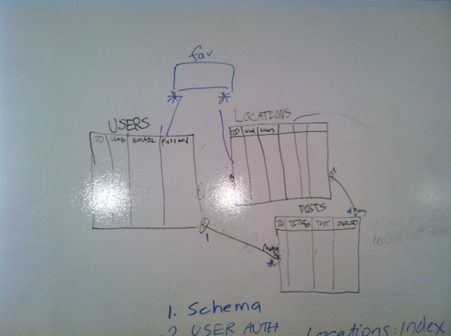

#PerfSurf

### App Description
- PerfSurf is an application that forecasts surfing/kitesurfing relative wind and wave information world wide. The application has the goal to give the user a visual depiction of surfing conditions worldwide as well as more detailed information for specific locations.

-[http://perfsurf.herokuapp.com](http://perfsurf.herokuapp.com/)

### Technologies Implemented 

- Ruby On Rails/Active Record/PostgreSQL
- JavaScript/jQuery/AJAX/Underscore.js
- MagicSeaweed Surf API, Instagram API, & Google Maps API

### Schema

- PerfSurf utilizes the Magic Seaweed API to get a variety local forecast information for specific locations.  Unfortunately the API does not provide lattitude and longitude information and this must be retrieved manually and entered into the database by an admin user.

- The admin section of the application allows an admin to upload a location with it's name, a photo, coordinates, and the Magic Seaweed ID that is associated with the specific location.  

- The Magic Seaweed API can then queried to get the location specific forecasting details.

- Latitude and longitude coordinates are also used to query the Instagram API and display the latest publicly available Instagram pictures for the location.

- Users can then view these locations on a Google Map, and animate the locations to get an overview of world wide conditions for the following 5 days.  Users can also view locations specific information in custom charts on the single locations pages.

- Lastly, a user can favorite a location for ease of navigation to the location upon subsequent login. 

## Roles 

- David Fox-Powell: Team Project Lead
- Maria Mercedes Martinez: Design Lead
- Sal Lardizzone: Research Lead