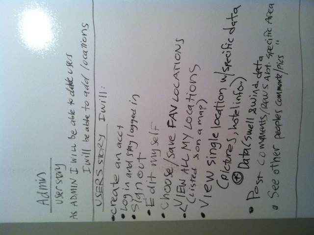
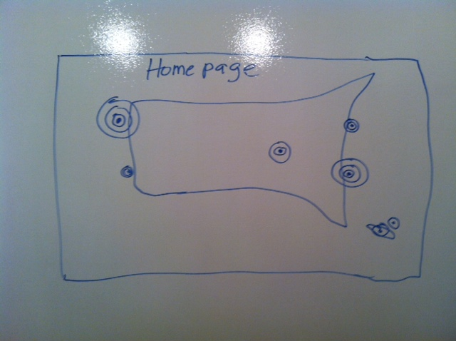
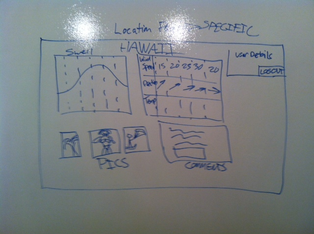

#PerfSurf

### App Description
PerfSurf will be a Ruby on Rails application that will facilitate the search for the perfect surfing locations around the world. Users will be able to save favorite locations and see the weather conditions for that location to determine if it is a good time to hit the waves. 

### User Stories

Administrator - As an administrator I will be able to: 
-  delete users
-  add locations

Users - As a user I will be able to:
- create an account
- log in and stay logged in
- sign out 
- edit my profile
- choose/save favorite locations
- view all of my locations on a map
- view single location w/specific data (data w/swell & wind data, pictures, hotel info, etc)
- post comments/reviews about a specific area
- see other peoples’ comments/pictures

### Schema

### WireFrames

###### HOMEPAGE

###### LOCATION PAGE

###### USER PAGE

### Libraries/APIs 

- JQuery
- Underscore.js
- MagicSeaweed API 
- NOAA Weather 

## Roles 

David: Team Project Lead
Maria: Design Lead